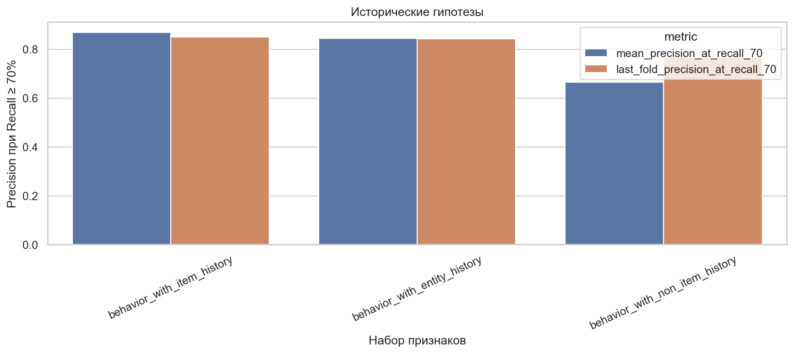
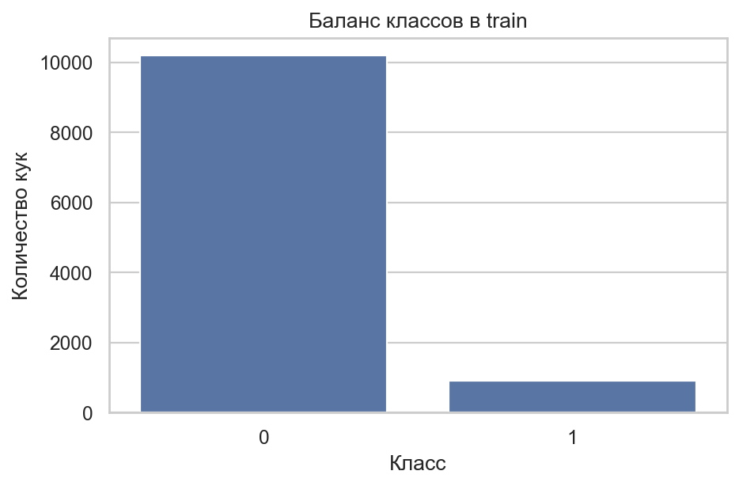
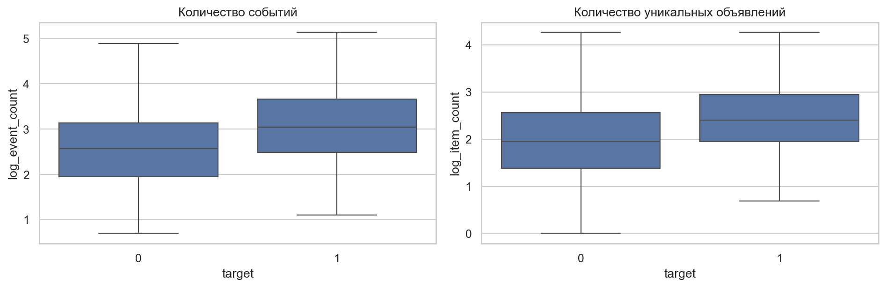
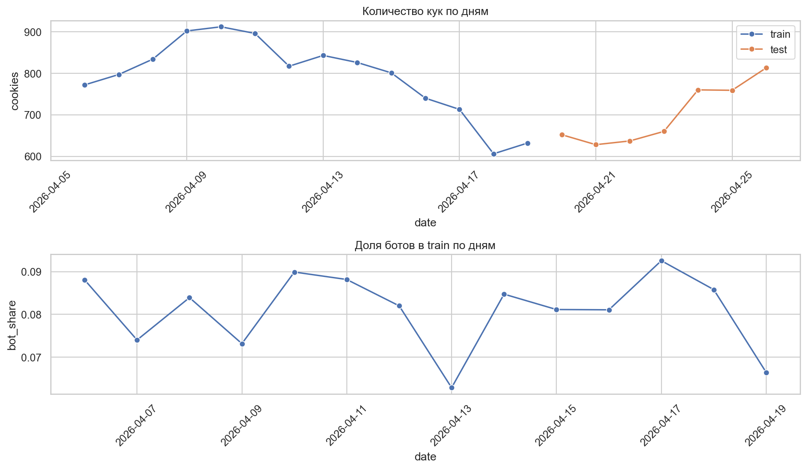
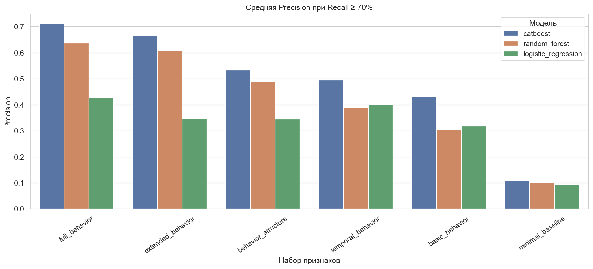
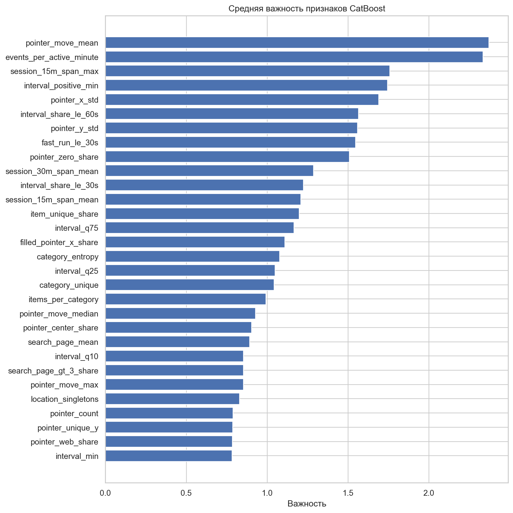

# Обзор Решения

Нужно определить автоматизированный трафик по событиям внутри суточного окна и присвоить каждой `cookie_id` оценку от 0 до 1. Основная сложность задачи не в выборе самой мощной модели, а в корректной работе со временем: `test` расположен позже `train`, а часть сильных признаков опирается на историю объявлений.

## Результаты

Финальная сборка получила **0,86968** по основной метрике на скрытой тестовой выборке. Первый рабочий сабмишн давал 0,81566, то есть история объявлений принесла ещё **0,05402** абсолютного значения.

| Этап | Схема проверки | P@R≥70% | Последний период | Средняя AP | Проверяющая система |
|---|---|---:|---:|---:|---:|
| Полный поведенческий набор, базовый CatBoost | 3 временных периода | 0,71405 | 0,78322 | 0,76985 | не отправлялся |
| Компактный набор, базовый CatBoost | 3 временных периода | 0,65440 | 0,64740 | 0,76631 | не отправлялся |
| Компактный набор, настроенный CatBoost | первые 2 периода | 0,72650 | не измерялся | 0,78830 | 0,81566 |
| **Поведение и история объявлений** | **3 временных периода** | **0,86866** | **0,85075** | **0,80890** | **0,86968** |

AP - средняя точность по всей кривой полнота-точность. Она нужна для диагностики, но решения принимались по официальной P@R≥70%. Для настроенного компактного варианта в таблице показан подбор на первых двух периодах, поэтому это число нельзя напрямую сравнивать со средним по трём периодам.



## Как решалась задача

### Бейзлайны

Начали с максимально простого набора: число событий и число уникальных объявлений. На нём лучший CatBoost получил всего 0,108 - одного объёма активности явно недостаточно. Затем признаки добавлялись смысловыми блоками, а на каждом этапе одинаково сравнивались логистическая регрессия, случайный лес и CatBoost.

Лучшим базовым вариантом стал CatBoost на полном поведенческом наборе: средняя временная метрика выросла до 0,714. Это и стало основной точкой отсчёта для дальнейших экспериментов.

### Наборы признаков

| Набор | Размер | Зачем он нужен |
|---|---:|---|
| Минимальный → полный | от 2 до 654 | Проверить вклад объёма, ритма, повторов, переходов, клиента и курсора |
| Расширенный | 1 020 | Собрать широкий пул кандидатов и проверить, помогает ли простое наращивание признаков |
| Компактный | 60 локальных, 66 в модели | Убрать часть шума и получить управляемое ядро для настройки |
| Богатый локальный | 705 | Добавить последовательности, курсор, структуру пропусков и хешированные строки |
| Финальный | 719 | Дополнить локальное поведение восемью агрегатами истории объявлений и частотами категорий |

Финальный набор состоит из 60 отобранных поведенческих признаков, 270 признаков последовательностей, 81 признака курсора, 96 признаков пропусков, 198 признаков хешированного текста, 8 агрегатов истории объявлений и 6 частотных колонок.

### Эволюция решения

| Шаг | Что изменили | Результат |
|---|---|---:|
| Минимальный бейзлайн | Два простых счётчика | 0,108 на временной проверке |
| Полное поведение | Ритм, структура действий, клиент и курсор | 0,714 на временной проверке |
| Компактный CatBoost | Отбор признаков и настройка глубины и числа деревьев | 0,81566 на проверяющей системе |
| H10 | История пяти типов сущностей | 0,844 на временной проверке |
| H11 | Убрали историю объявлений | 0,665 - основной прирост исчез |
| **H12** | Оставили только историю объявлений | **0,86866 локально и 0,86968 на проверяющей системе** |

Главный прирост дал не более сложный алгоритм, а новый источник сигнала. Локальные действия описывают текущие сутки, а история показывает, что автоматизированный трафик часто возвращается к уже встречавшимся объявлениям. Сам `item_id` при этом модели не передаётся: используются только сглаженные агрегаты по более ранней разметке.

## Навигация по проекту

### Ноутбуки

| Ноутбук | Что в нём находится |
|---|---|
| [Разведывательный анализ данных](notebooks/eda.ipynb) | Качество данных, пропуски, дубликаты, временные границы, сдвиг и возможные утечки |
| [Базовые эксперименты](notebooks/base_experiments.ipynb) | Шесть наборов признаков, три семейства моделей и временная проверка |
| [Отбор признаков и настройка CatBoost](notebooks/catboost_selection.ipynb) | Важность признаков, компактный набор и подбор глубины и числа деревьев |
| [Первый файл с предсказаниями](notebooks/submission_compact_behavior.ipynb) | Обучение компактной модели на всём `train` и первый сабмишн |
| [Гипотезы H10-H12](notebooks/history_experiments.ipynb) | История сущностей, контроль без объявлений и анализ холодного старта |
| [Финальный файл с предсказаниями](notebooks/submission_item_history.ipynb) | Воспроизводимое обучение H12 и сохранение итогового `submission.csv` |

### Основные модули

| Файл | Ответственность |
|---|---|
| [`src/data.py`](src/data.py) | Загрузка таблиц, временные окна и подготовка событий |
| [`src/behavior_features.py`](src/behavior_features.py) | Базовые поведенческие признаки |
| [`src/history_features.py`](src/history_features.py) | Последовательности, курсор, пропуски, текст и история сущностей |
| [`src/feature_sets.py`](src/feature_sets.py) | Составы наборов и кеширование тяжёлых вычислений |
| [`src/models.py`](src/models.py) | Предобработка, обучение трёх моделей и важность признаков |
| [`src/validation.py`](src/validation.py) | Временные разбиения и проверки утечек |
| [`src/experiments.py`](src/experiments.py) | Единый цикл эксперимента и сохранение артефактов |
| [`src/submission.py`](src/submission.py) | Финальное обучение и девять проверок файла с предсказаниями |
| [`src/metric.py`](src/metric.py) | Точная реализация официальной метрики |

## Содержание подробного отчёта

- [Постановка задачи и метрика](#постановка-задачи-и-метрика)
- [Разведывательный анализ данных](#разведывательный-анализ-данных)
- [Построение поведенческих признаков](#построение-поведенческих-признаков)
- [Модели](#модели)
- [Временная перекрёстная проверка](#временная-перекрёстная-проверка)
- [Базовые эксперименты](#базовые-эксперименты-от-объёма-к-структуре-поведения)
- [Отбор признаков](#гипотеза-можно-убрать-шум-по-важности-признаков)
- [Настройка CatBoost](#эксперимент-с-ёмкостью-catboost)
- [Первый файл с предсказаниями](#первый-файл-с-предсказаниями)
- [Гипотезы H10-H12](#гипотезы-h10h12)
- [Финальная сборка](#финальная-сборка)
- [Защита от утечек](#защита-от-утечек)
- [Структура проекта](#структура-проекта)
- [Воспроизведение](#воспроизведение)
- [Ограничения решения](#ограничения-решения)
- [Перенос в рабочую систему](#как-это-перенести-в-рабочую-систему)

---

# Как воспроизвести отправленный результат

В репозитории уже лежат исходные таблицы, точные версии библиотек, зафиксированный состав признаков и параметры финальной модели. Для повторения отправленного результата не нужно заново запускать всё исследование и подбирать параметры.

## Подготовка окружения

Склонируйте репозиторий и создайте отдельное окружение Python 3.13:

```bash
git clone https://github.com/KolyaNG1/TestTask-ClassicML-3-avito-ds-bootcamp.git
cd TestTask-ClassicML-3-avito-ds-bootcamp
python -m venv .venv
```

Активируйте окружение. В Windows:

```powershell
.venv\Scripts\Activate.ps1
```

В Linux или macOS:

```bash
source .venv/bin/activate
```

Установите зависимости:

```bash
python -m pip install --upgrade pip
python -m pip install -r requirements.txt
```

## Получение финального `submission.csv`

Финальный файл строится в [`notebooks/submission_item_history.ipynb`](notebooks/submission_item_history.ipynb). Ноутбук можно запускать как из корня проекта, так и из папки `notebooks`: путь к корню определяется автоматически.

Этот единственный ноутбук выполняет весь необходимый для финального ответа путь:

1. читает `train.csv`, `test.csv`, `events.csv.gz` и официальный пример ответа;
2. оставляет только события внутри разрешённых суточных окон и исключает `captcha_shown`;
3. заново строит локальные признаки и строго прошлую историю объявлений;
4. обучает CatBoost на всём `train` с зафиксированными параметрами и начальным числом 42;
5. проверяет состав колонок, отсутствие идентификаторов и корректность всех оценок;
6. сохраняет модель, правила предобработки и готовый файл в новой папке `submissions/item_history/<дата_и_время>/`.

Первый расчёт признаков занимает заметно больше времени, потому что кэши создаются с нуля. Повторный запуск использует сохранённые промежуточные таблицы. Финальный ноутбук намеренно обучает модель на процессоре: это исключает различия между реализациями CatBoost для процессора и видеокарты и позволяет повторить отправленные оценки.

Копия отправленного файла находится в [`submissions/item_history/20260928_164138/submission.csv`](submissions/item_history/20260928_164138/submission.csv). Новый файл должен содержать те же 4 909 строк в том же порядке.

Если требуется повторить не только итоговый файл, но и весь ход исследования, ноутбуки запускаются последовательно:

1. [`notebooks/eda.ipynb`](notebooks/eda.ipynb);
2. [`notebooks/base_experiments.ipynb`](notebooks/base_experiments.ipynb);
3. [`notebooks/catboost_selection.ipynb`](notebooks/catboost_selection.ipynb);
4. [`notebooks/submission_compact_behavior.ipynb`](notebooks/submission_compact_behavior.ipynb);
5. [`notebooks/history_experiments.ipynb`](notebooks/history_experiments.ipynb);
6. [`notebooks/submission_item_history.ipynb`](notebooks/submission_item_history.ipynb).

Первые пять шагов нужны для воспроизведения исследовательского пути, но не являются зависимостью финального обучения: выбранные признаки и параметры уже зафиксированы в коде и приложенных артефактах.

---

# Подробный отчёт

Ниже - полная история исследования: от аудита исходных данных и первых бейзлайнов до гипотезы, которая дала финальный прирост.

## Постановка задачи и метрика

Одна строка обучающей или тестовой выборки соответствует одной куки и одному суточному окну наблюдения. По событиям внутри этого окна нужно предсказать:

- `target = 1` - трафик известных сервисов автоматизированного сбора данных;
- `target = 0` - трафик, отнесённый к человеческому.

Итоговый файл содержит `cookie_id` и непрерывную оценку `score`. Порог заранее выбирать не нужно.

Основная метрика - максимальная точность положительных предсказаний среди порогов, на которых полнота не ниже 70%:

$$
\mathrm{P@R}_{\ge 0.7} =
\max_{t:\,\mathrm{Recall}(t)\ge 0.7}\mathrm{Precision}(t).
$$

Иными словами, модель обязана найти хотя бы 70% ботов, после чего оценивается доля настоящих ботов среди отмеченных кук. Из-за такого ограничения обычная доля правильных ответов не подходит, особенно при доле положительного класса около 8%.

Реализация метрики находится в [`src/metric.py`](src/metric.py). Она корректно объединяет одинаковые значения `score` и совпадает с официальным определением.

## Разведывательный анализ данных

До построения признаков были проверены размеры таблиц, пропуски, выбросы, дубликаты, временные границы, порядок `train` и `test`, запрещённые события и повторяемость сущностей.

| Наблюдение | Результат |
|---|---:|
| Строк в `train` | 11 091 |
| Строк в `test` | 4 909 |
| Ботов в `train` | 899 (8,11%) |
| Исходных событий | 328 905 |
| Событий внутри разрешённых окон | 288 126 |
| Событий вне окон | 40 779 |
| Показов капчи | 7 928, все вне разрешённых окон |
| Лишних копий строк внутри окон | 4 293 |
| Групп с несколькими событиями в одну секунду | 5 754 |



### Дисбаланс класса

Положительный класс занимает 8,11% обучающей выборки. По дням доля ботов меняется от 6,29% до 9,26%: дисбаланс сильный, но резкого изменения базовой доли класса внутри `train` нет.

Из этого следуют три решения:

1. Обычная доля правильных ответов не используется: константный прогноз почти всегда «человек» дал бы около 92% правильных ответов и не решал бы задачу.
2. Все модели сравниваются по официальной P@R≥70%; AP и ROC-AUC сохраняются только как дополнительные характеристики ранжирования.
3. Искусственное увеличение положительного класса и веса классов не применяются. Модель обучается на естественной доле классов, а рабочая область выбирается метрикой по порогу. Это осознанная базовая настройка, а не доказательство того, что взвешивание никогда не поможет.

### Пропуски, дубликаты и крайние значения

Пропусков в `train` и `test` нет. В событиях они в основном структурные: поисковый запрос и страница отсутствуют в 68,83% строк, координаты курсора - в 66,80%, объявление - в 33,13%, тип продавца - в 39,14%. Например, запрос заполнен только для просмотра выдачи, а координаты доступны не на всех платформах.

Поэтому пропуски не заполняются одним общим значением до разделения данных. Доли и сочетания пропусков становятся отдельными признаками, а числовые медианы и наиболее частые категории вычисляются только по обучающей части очередного временного периода.

Боты в среднем активнее: 29,5 события на куку против 16,9 у остальных. Однако распределения пересекаются, поэтому одного объёма активности недостаточно.

Распределение активности имеет длинный правый хвост: 99-й процентиль числа событий равен 79 у отрицательного класса и 134 у ботов, максимумы - 140 и 169. Эти значения находятся внутри корректных суточных окон и согласуются с природой задачи, поэтому они не объявляются ошибками и не обрезаются. Для скошенных счётчиков дополнительно строятся логарифмы, а деревья могут выделять нелинейные области без ручного порога.

Внутри окон найдено 4 293 лишних копии строк. У ботов их в среднем 0,447 на куку против 0,250 у остальных. Удаление дублей потеряло бы потенциальный поведенческий сигнал, поэтому исходные события сохраняются, а число и доля дублей передаются модели отдельными признаками.



### Временная структура

Обучающие окна начинаются с 6 по 19 апреля 2026 года, тестовые - с 20 по 26 апреля. Значит, случайное перемешивание дало бы модели информацию из будущего и завысило оценку.



Для признаков используются только события из полуинтервала `window_start_ts <= event_ts < window_end_ts`. Показ капчи после этой фильтрации отсутствует и ни в один признак не входит.

Проверка базовых числовых признаков не выявила сильного сдвига между `train` и `test`: максимальная статистика Колмогорова-Смирнова равна 0,0256. Это не доказывает полного равенства распределений, но не даёт оснований удалять признаки или менять схему проверки только из-за общего сдвига.

### Переносимость сущностей

Категории, регионы, поисковые запросы и строки клиента из `test` полностью покрываются обучающей выборкой. Для объявлений покрытие ниже, но всё ещё велико:

- 80,66% уникальных объявлений из `test` встречались в `train`;
- у 97,17% тестовых кук есть хотя бы одно знакомое объявление;
- средняя доля знакомых объявлений внутри тестовой куки равна 80,72%;
- у 65 тестовых кук вообще нет событий с объявлениями.

Последнее наблюдение стало основанием отдельно проверить прошлую историю объявлений, предусмотрев безопасное значение для новых объектов.

### Что изменилось после EDA

Разведывательный анализ напрямую определил дальнейший план:

- сильный дисбаланс зафиксировал основную метрику и сделал точность классификации бесполезной;
- временной порядок потребовал проверки на будущих периодах вместо случайного перемешивания;
- структурные пропуски стали отдельным блоком признаков;
- длинные хвосты счётчиков привели к использованию исходных и логарифмированных значений, а не к слепому удалению «выбросов»;
- дубликаты были сохранены как сигнал;
- неизвестный порядок событий в одну секунду привёл к представлению через неупорядоченные моменты;
- высокая повторяемость объявлений сформировала гипотезу о строго прошлой истории `item_id`.

После семи автоматических проверок данных все куки покрыты событиями, идентификаторы уникальны и не пересекаются, `test` расположен после `train`, а запрещённая капча отсутствует. Только после этого начинается моделирование.

Подробные таблицы и графики: [ноутбук EDA](notebooks/eda.ipynb) и [`reports/tables/eda/`](reports/tables/eda/).

## Построение поведенческих признаков

До первых моделей был составлен широкий каталог признаков. Это не случайное механическое расширение таблицы, а результат последовательного разбора поведения автоматизированного клиента: какие действия он выполняет, с какой скоростью, насколько регулярно, как переключается между объектами и насколько естественно использует интерфейс.

Признаки добавлялись накопительными блоками:

| Набор | Признаков до внутрискладочных преобразований | Проверяемая гипотеза |
|---|---:|---|
| `minimal_baseline` | 2 | Число событий и уникальных объявлений |
| `basic_behavior` | 58 | Действия, платформы, разнообразие и возраст куки |
| `temporal_behavior` | 145 | Интервалы, скорость, ритм и сессии |
| `behavior_structure` | 437 | Повторы, переключения, поиск и переходы между действиями |
| `full_behavior` | 654 | Клиент, категории, регионы, курсор и отношения признаков |
| `extended_behavior` | 1 020 | Регулярность, быстрые серии и расширенные профили |

Для категориальных колонок дополнительно считаются частоты по обучающей части каждого временного разбиения. Поэтому полный и расширенный наборы содержат в модели 660 и 1 026 колонок соответственно.

Полный смысл и формула каждого семейства приведены в [каталоге поведенческих признаков](docs/behavior_features.md). Фактические списки колонок сохраняются вместе с каждым запуском.

Широкий каталог нужен не для того, чтобы один раз передать модели «всё подряд». Каждый следующий набор отвечает на отдельный вопрос: достаточно ли объёма, нужен ли ритм, важны ли возвраты, даёт ли сигнал взаимодействие с интерфейсом. Накопительная схема позволяет связать изменение метрики с добавленным смысловым блоком. Расширенный набор намеренно используется как пространство кандидатов для последующего отбора.

## Модели

Три модели выбраны не просто «для количества». Каждая отвечает на свой вопрос о структуре данных:

- логистическая регрессия проверяет, хватает ли простых линейных сочетаний;
- случайный лес показывает, что дают нелинейные правила и взаимодействия;
- CatBoost проверяет последовательное исправление ошибок деревьев и нативную работу с категориями.

Сначала параметры были зафиксированы заранее. Так сравнение оставалось честным: менялись данные и модель, а не удачность отдельного подбора.

Предобработка также является частью каждого опыта:

- для логистической регрессии числовые признаки заполняются медианой и стандартизируются, категории кодируются отдельными бинарными колонками;
- для случайного леса применяется такое же заполнение и кодирование категорий, но без стандартизации;
- для CatBoost медианы считаются по обучающей части, а категории передаются модели строками;
- неизвестные на проверке категории обрабатываются безопасно;
- все преобразования обучаются после временного разделения, а не на общей таблице.

Чтобы не копировать предобработку и обучение между опытами, общая логика вынесена из ноутбуков:

- [`src/models.py`](src/models.py) - создание, обучение и важность моделей;
- [`src/experiments.py`](src/experiments.py) - единый цикл временной проверки;
- [`src/validation.py`](src/validation.py) - разбиения и проверки утечек;
- [`src/artifacts.py`](src/artifacts.py) - сохранение и повторное использование результатов.

## Временная перекрёстная проверка

Случайное разбиение здесь не соответствует будущему применению. Поведение, каталог и источники автоматизированного трафика меняются по дням; кроме того, для исторических признаков случайное смешивание позволило бы использовать более позднюю разметку при описании ранней куки. Поэтому используются три расширяющихся разбиения: модель каждый раз знает только прошлое и проверяется на следующих датах.

| Период | Обучающие даты | Обучающих строк | Проверочные даты | Проверочных строк | Ботов на проверке |
|---|---|---:|---|---:|---:|
| 1 | 6-12 апреля | 5 930 | 13-14 апреля | 1 669 | 123 (7,37%) |
| 2 | 6-14 апреля | 7 599 | 15-16 апреля | 1 541 | 125 (8,11%) |
| 3 | 6-16 апреля | 9 140 | 17-19 апреля | 1 951 | 160 (8,20%) |

Внутри каждого разбиения заново выполняются:

1. расчёт медиан и правил обработки категорий;
2. построение частотных справочников;
3. построение агрегатов целевой переменной по строго прошлой истории;
4. обучение модели и получение прогнозов только для следующего периода.

Основной результат - средняя P@R≥70% трёх периодов. Вместе с ней сохраняются стандартное отклонение, результат последнего периода, AP и ROC-AUC. Метрика на объединённых проверочных прогнозах приведена как диагностика: у разных периодов могут быть разные шкалы оценок, поэтому она не заменяет среднее по периодам.

Такая схема ближе к применению модели: она учится на накопленной истории и работает на следующих днях.

Временная проверка не устраняет всю неопределённость: доступно только 14 обучающих дней и три проверочных окна. Поэтому при выборе решения учитываются не только среднее значение, но также последний период, разброс и содержательная устойчивость признака.

## Базовые эксперименты: от объёма к структуре поведения

Ниже приведена средняя Precision при Recall не ниже 70% на трёх временных периодах.

| Набор | Логистическая регрессия | Случайный лес | CatBoost |
|---|---:|---:|---:|
| Минимальный | 0,095 | 0,101 | **0,108** |
| Основная активность | 0,319 | 0,304 | **0,433** |
| Временной ритм | 0,402 | 0,390 | **0,496** |
| Структура поведения | 0,345 | 0,491 | **0,534** |
| Полный поведенческий | 0,427 | 0,638 | **0,714** |
| Расширенный | 0,346 | 0,608 | **0,667** |



Эксперименты последовательно ответили на исходные вопросы:

- **Одного объёма недостаточно.** Два счётчика дают CatBoost только 0,108 - немногим больше базовой доли класса.
- **Ритм действительно полезен.** Переход от основной активности к временным признакам поднимает CatBoost с 0,433 до 0,496.
- **Структура действий добавляет сигнал.** Повторы, переключения и переходы повышают результат до 0,534.
- **Контекст и взаимодействие с интерфейсом особенно важны.** Полный набор с клиентом, категориями, регионами и курсором достигает 0,714.
- **Больше признаков не всегда лучше.** Расширение с 654 до 1 020 локальных колонок снижает CatBoost до 0,667 и ухудшает две другие модели. Гипотеза «передать модели все придуманные признаки» отвергнута.

CatBoost победил на каждом содержательном наборе. На лучшем базовом наборе он опередил случайный лес на 0,076, а логистическую регрессию - на 0,287. Поэтому дальнейшие эксперименты проводились только с CatBoost.

Полный CatBoost также улучшается по мере роста обучающей истории: 0,649, 0,710 и 0,783 на последовательных периодах. Среднее AP равно 0,770, ROC-AUC - 0,938. Рост последнего периода поддерживает выбранную схему с накоплением истории, но одновременно показывает, почему одной случайной проверки было бы недостаточно.

После этого CatBoost был зафиксирован как основная модель, полный набор - как сильная точка отсчёта, а расширенный - как источник кандидатов для отбора.

Полная таблица находится в [`reports/tables/base_experiments.csv`](reports/tables/base_experiments.csv), подробный запуск - в [ноутбуке базовых экспериментов](notebooks/base_experiments.ipynb).

## Гипотеза: можно убрать шум по важности признаков

Для расширенного CatBoost была сохранена важность каждого признака на каждом временном разбиении.



Среди лидеров оказались скорость событий, характеристики интервалов, длина сессий, повторяемость объявлений и параметры движения курсора. В компактный вариант вошли:

- 40 числовых признаков из исследовательского отбора;
- 12 признаков, оставленных по смыслу задачи;
- 8 устойчивых категориальных признаков.

Итого получилось 60 локальных и 66 модельных признаков после частотного кодирования. Исходные идентификаторы и даты в список не входят.

Контрольный запуск базовых параметров на процессоре дал среднюю метрику 0,654. Это ниже полного поведенческого набора: одно только сокращение признаков не стало улучшением. Компактный набор был сохранён как основа для более содержательных блоков и настройки модели.

Важность CatBoost здесь используется как средство ранжирования кандидатов, а не как доказательство причинной связи. Чтобы не потерять редкий, но содержательно понятный сигнал, к признакам с высокой важностью добавлены 12 колонок по смыслу задачи. Такой гибридный отбор оказался предпочтительнее слепого порога по одной таблице важности.

Важно: список признаков изучался по результатам временной проверки, поэтому третий период после этого нельзя считать полностью независимым. Независимой окончательной оценкой остаётся скрытый `test`.

Гипотеза о том, что сокращение само по себе улучшит качество, не подтвердилась. Поэтому компактный набор не стал финальным: дальше он использовался как контролируемое ядро для настройки и новых блоков.

## Эксперимент с ёмкостью CatBoost

После сокращения признаков проверялись только два основных параметра: глубина дерева и число деревьев. Перебор выполнялся на первых двух временных периодах.

Сетка намеренно небольшая. В выборке только 899 положительных примеров, поэтому широкий поиск по десяткам параметров увеличил бы риск подстройки под три доступных периода. Глубина управляет сложностью взаимодействий, число деревьев - продолжительностью обучения; остальные параметры оставлены фиксированными.

| Глубина | Деревьев | Средняя метрика | Разброс |
|---:|---:|---:|---:|
| **3** | **1 200** | **0,7265** | 0,0192 |
| 9 | 1 200 | 0,7221 | 0,0237 |
| 7 | 1 200 | 0,7206 | 0,0189 |
| 3 | 1 500 | 0,7188 | 0,0228 |
| 7 | 700 | 0,7188 | 0,0092 |

Завершились 15 из 16 сочетаний. Вариант глубины 9 с 1 500 деревьями не успел завершиться, но соседние результаты уже не показывали устойчивого улучшения при дальнейшем усложнении.

Подбор выполнялся на видеокарте, а контрольные и финальные модели - на процессоре. CatBoost использует в этих режимах разные способы построения деревьев, поэтому значения не следует ожидать одинаковыми до последнего знака. Зафиксированы глубина 3, 1 200 деревьев, скорость обучения 0,05 и коэффициент регуляризации 3.

В итоге выбрана наиболее простая из лидирующих конфигураций - глубина 3 и 1 200 деревьев. Она дала лучший средний результат и требует меньше вычислений, чем глубокие альтернативы.

Полная таблица: [`reports/tables/catboost_grid_previous_run.csv`](reports/tables/catboost_grid_previous_run.csv). Ход отбора: [ноутбук настройки CatBoost](notebooks/catboost_selection.ipynb).

## Первый файл с предсказаниями

CatBoost на компактном наборе был обучен на всём `train`. Файл прошёл девять проверок формата: нужное число строк, уникальные `cookie_id`, правильный порядок, отсутствие пропусков и конечные оценки от 0 до 1.

Результат проверяющей системы - **0,81566**. Этот запуск использовался как внешний контроль работоспособности всего конвейера: фильтрации событий, полного обучения, порядка строк и формирования файла. По скрытому `test` не подбирались отдельные признаки или пороги; после результата исследование вернулось к гипотезам, которые можно проверить на размеченном `train`.

**Вывод:** локальное поведение уже отделяет ботов, но компактная модель не использует информацию, накопленную до текущего окна. Следующий вопрос - можно ли безопасно добавить прошлую репутацию сущностей, не передавая модели сами идентификаторы.

Сборка первого файла: [ноутбук компактного сабмита](notebooks/submission_compact_behavior.ipynb).

## Гипотезы H10-H12

Главная идея следующего этапа: автоматизированные сервисы возвращаются к одним и тем же объявлениям, а значит, прошлое поведение вокруг объявления может быть полезнее ещё одного локального счётчика.

### H10: история нескольких сущностей

Гипотеза: сервисы автоматизированного сбора могут возвращаться к одним и тем же объявлениям, запросам и техническим клиентам. Для объявления, запроса, строки клиента и двух составных контекстов были рассчитаны сглаженные исторические доли ботов, покрытие историей и объём прошлого. Используются только строго более ранние дни.

Средняя метрика достигла **0,84434** против 0,71405 у лучшего базового CatBoost. Гипотеза сработала, но оставался вопрос, какая именно сущность дала прирост и не маскирует ли широкий блок запоминание высококардинальных строк.

### H11: контроль вклада объявлений и новых объектов

Для проверки из исторического блока удалили объявления, сохранив запросы, строки клиента и составные контексты. Модель получила только **0,66509**. Значит, прирост H10 нельзя объяснить общим запоминанием запросов или строк клиента; без объявлений исторический блок даже уступает лучшему локальному набору.

Дополнительно результат был разделён на куки со знакомыми и новыми объявлениями. В проверочных периодах знакомые объявления есть у 93,9-96,2% кук, и почти все боты находятся именно в этой группе. В группах с новыми объявлениями было всего ноль или один бот, поэтому отдельная метрика для них слишком неустойчива для выбора модели.

Для неизвестного `item_id` модель не получает ошибку или специальный идентификатор: историческая доля сглаживается к средней доле ботов, а решение продолжают поддерживать локальные поведенческие признаки.

Так стало понятно, что история объявления - самостоятельный полезный сигнал. Оставалось сохранить защиту от холодного старта и проверить более простой вариант без остальных сущностей.

### H12: только история объявлений

Из исторического блока были удалены запросы, строки клиента и составные сущности. Остались восемь агрегатов по объявлениям:

- доля объявлений, встречавшихся в прошлом;
- среднее, максимум, 75-й процентиль и разброс прошлой доли ботов;
- среднее трёх наиболее подозрительных значений;
- среднее и максимальное число прошлых наблюдений.

Для доли ботов используется сглаживание с коэффициентом 25. При обучении свежие строки получают больший вес, период полураспада равен пяти дням.

| Вариант | Признаков | Средняя метрика | Последний период | Объединённая метрика |
|---|---:|---:|---:|---:|
| Все пять историй | 751 | 0,84434 | 0,84211 | 0,85373 |
| Без истории объявлений | 743 | 0,66509 | 0,76712 | 0,65227 |
| **Только история объявлений** | **719** | **0,86866** | **0,85075** | **0,85588** |

Простой вариант оказался одновременно точнее и устойчивее. Он был выбран для финального обучения.

По периодам H12 получила 0,8462, 0,9091 и 0,8507. Стандартное отклонение равно 0,0286 против 0,0548 у лучшего базового CatBoost. Таким образом, улучшилось не только среднее значение, но и устойчивость между датами.

Почему сработало упрощение: объявление связывает активность нескольких кук с общим объектом сбора, тогда как запросы и строки клиента более вариативны и добавляют шум. Сглаживание не позволяет редкому объявлению получить экстремальную оценку по одному наблюдению, а локальные признаки сохраняют работоспособность при отсутствии истории.

В финальной сборке осталась только история объявлений. Исходный `item_id` в модель не передаётся, коэффициент сглаживания равен 25, а свежие обучающие дни получают больший вес.

Формулы всех новых признаков приведены в [каталоге дополнительных и исторических признаков](docs/history_features.md). Эксперименты и анализ покрытия находятся в [ноутбуке H10-H12](notebooks/history_experiments.ipynb).

## Финальная сборка

После выбора H12 CatBoost обучается на всех 11 091 строках `train` и предсказывает 4 909 строк `test`.

| Параметр | Значение |
|---|---:|
| Число признаков | 719 |
| Глубина | 3 |
| Число деревьев | 1 200 |
| Скорость обучения | 0,05 |
| Регуляризация листьев | 3 |
| Начальное число генератора | 42 |
| Режим обучения | процессор |

Перед сохранением код проверяет названия колонок, число и порядок строк, уникальность и состав `cookie_id`, числовой тип оценок, отсутствие пропусков и бесконечностей, а также диапазон от 0 до 1. Итоговый файл прошёл все девять проверок; его оценки лежат от 0,000504 до 0,999751.

**Финальная метрика проверяющей системы: 0,86968.**

Она отличается от средней временной оценки 0,86866 всего на 0,00102. Такое совпадение не доказывает качество на любом будущем периоде, но показывает, что выбранная проверка хорошо оценила именно этот тестовый отрезок.

Ноутбук воспроизведения: [финальный файл с предсказаниями](notebooks/submission_item_history.ipynb).

## Защита от утечек

Основной риск задачи - незаметно передать модели события или разметку из будущего. Защита встроена не только в текст исследования, но и в код:

- события ограничены полуинтервалом текущего окна;
- `captcha_shown` исключён;
- проверочные даты всегда позже обучающих;
- медианы и частоты считаются только по обучающей части разбиения;
- история сущности использует только более ранние дни;
- разметка кук того же дня при построении истории недоступна;
- словари категориальных профилей фиксируются по ранней обучающей части;
- `cookie_id`, `item_id`, `query_id`, даты и другие исходные идентификаторы не передаются модели;
- разметка `test` недоступна; сами тестовые признаки используются только для диагностики покрытия и построения финальных агрегатов, но не для обучения и подбора параметров;
- до обучения проверяются совпадение схемы колонок и конечность числовых значений.

Идентификаторы нужны только для соединения таблиц и агрегации. После построения признаков защита в [`src/validation.py`](src/validation.py) запрещает все колонки, оканчивающиеся на `_id`.

Агрегирование целевой переменной по объявлениям выполняется по следующему правилу:

- для обучающей куки доступны только размеченные куки из строго предыдущих дней;
- для очередного проверочного периода доступны только строки его обучающей части;
- для финального `test` доступен весь `train`, потому что он полностью расположен раньше тестовых окон;
- один и тот же код используется при временной проверке и финальном обучении.

За всё исследование внешняя метрика использовалась для двух содержательных контрольных точек: компактной модели и заранее выбранной H12. Основной выбор между гипотезами выполнялся по временной проверке на `train`, а не серией попыток подогнать скрытый набор.

## Структура проекта

Ноутбуки оставлены для хода исследования и визуального отчёта, а тяжёлая логика вынесена в обычные модули. Благодаря этому один и тот же код используется и на временной проверке, и при финальном обучении.

```text
├── data/                         # исходные данные
├── docs/
│   ├── behavior_features.md      # каталог базовых признаков
│   └── history_features.md       # каталог дополнительных признаков
├── notebooks/
│   ├── eda.ipynb
│   ├── base_experiments.ipynb
│   ├── catboost_selection.ipynb
│   ├── history_experiments.ipynb
│   ├── submission_compact_behavior.ipynb
│   └── submission_item_history.ipynb
├── src/                          # общая логика без копирования по ноутбукам
├── artifacts/                    # артефакты финальной временной проверки
├── reports/                      # таблицы и графики отчёта
├── submissions/                  # отдельная папка каждого итогового запуска
├── scripts/                      # запуск подготовки и опытов без ноутбуков
├── tests/                        # проверки метрики, времени и утечек
├── requirements.txt
└── README.md
```

Широкий набор признаков разбит на тематические классы. Ноутбуки отвечают за постановку опыта, показ результата и выводы, а не дублируют расчёты.

## Воспроизведение

Проект проверялся на Python 3.13.7, точные версии библиотек зафиксированы в `requirements.txt`. Все случайные компоненты используют одно начальное число - 42.

```bash
python -m pip install -r requirements.txt
```

Именно отправленный файл лежит в [`submissions/item_history/20260928_164138/submission.csv`](submissions/item_history/20260928_164138/submission.csv). Он был независимо получен старым исследовательским и новым структурированным конвейером: совпадают порядок всех 4 909 кук и каждое значение `score`.

Ноутбуки сами находят корень репозитория и используют готовые артефакты, если те уже существуют.

Полный порядок:

1. `notebooks/eda.ipynb`
2. `notebooks/base_experiments.ipynb`
3. `notebooks/catboost_selection.ipynb`
4. `notebooks/submission_compact_behavior.ipynb`
5. `notebooks/history_experiments.ipynb`
6. `notebooks/submission_item_history.ipynb`

Для получения только финального файла при наличии сохранённых признаков достаточно выполнить `submission_item_history.ipynb`.

Каждый опыт сохраняет конфигурацию, точный список признаков, предобработку, модель, проверочные прогнозы и метрики в собственной папке внутри `artifacts/`. Каждый итоговый запуск получает отдельную папку с временной меткой внутри `submissions/`, поэтому предыдущие результаты не перезаписываются.

Каталог запуска определяется хешем конфигурации и точного списка признаков, поэтому изменение состава данных не приводит к случайному использованию старой модели. Перед оформлением отчёта выполнены 10 автоматических тестов: проверяются официальная метрика, временные границы, отсутствие идентификаторов, воспроизводимость схемы признаков и формат итогового файла.

CatBoost умеет автоматически использовать видеокарту, если она доступна, и возвращается к процессору при ошибке устройства. Финальные зафиксированные модели обучены на процессоре, что указано в артефактах запуска.

## Ограничения решения

**Данных немного.** В обучении только 14 дней и 899 положительных примеров. Три временных периода показывают нестабильность между датами, но не заменяют проверку на длинной истории и сезонных сдвигах. Они также не дают надёжного доверительного интервала, поэтому небольшие различия между опытами нужно трактовать осторожно.

**Сильный сигнал зависит от покрытия историей.** При резком обновлении каталога доля кук без известных объявлений может вырасти. Для новых объектов остаются локальные признаки и сглаженное среднее, однако положительных примеров в этой группе пока слишком мало для надёжной отдельной оценки. Кроме того, рабочая система сможет использовать исторические доли только после появления подтверждённой разметки прошлых дней.

**Оценка не является откалиброванной вероятностью.** CatBoost используется для ранжирования, а рабочий порог придётся выбирать на свежем размеченном периоде и регулярно пересматривать. Промежуточная оценка компактного набора может быть оптимистичной, потому что признаки изучались на тех же временных периодах. Результат 0,86968 на скрытом наборе подтверждает выбранную сборку, но не гарантирует такое же качество после изменения источников трафика.

## Как это перенести в рабочую систему

Для регулярного применения понадобились бы четыре независимых процесса:

1. ежедневная проверка полноты и временных границ событий;
2. расчёт локальных признаков сразу после закрытия суточного окна;
3. обновление истории объявлений только после появления подтверждённой разметки;
4. наблюдение за долей новых объявлений, распределением оценок, полнотой при выбранном пороге и задержкой разметки.

Если покрытие историей снижается, модель не падает технически благодаря сглаживанию и локальным признакам, но это должно считаться сигналом возможного ухудшения качества. Переобучение следует запускать по времени или после подтверждённого сдвига, а новую модель сначала проверять на более позднем отрезке в режиме сравнения со старой.

## Точки роста

Текущий результат уже заметно выше первого рабочего решения, а совпадение временной и скрытой проверок показывает, что основной сигнал выбран удачно. Следующий прирост логичнее искать не в бесконтрольном расширении таблицы, а в повышении устойчивости и более точной работе с историей.

**Более длинная проверка по времени.** Четырнадцать обучающих дней позволяют построить только три достаточно крупных проверочных периода. На нескольких месяцах данных можно было бы проверить недельную сезонность, изменение источников трафика и устойчивость истории объявлений, а затем оценить разброс метрики между неделями.

**Настройка уже финальной сборки.** Глубина и число деревьев выбирались на компактном поведенческом наборе, после чего те же параметры были перенесены в H12. Честный следующий опыт - небольшой вложенный подбор глубины, числа деревьев, скорости обучения и регуляризации непосредственно на наборе с историей объявлений, не используя скрытую оценку для выбора.

**Отдельная стратегия для новых объявлений.** У 97,17% тестовых кук есть хотя бы одно знакомое объявление, поэтому исторический сигнал покрывает почти весь набор. Для полностью новых объявлений можно обучить отдельную локальную модель или выбирать другой порог, но сначала для этой группы нужно накопить больше положительных примеров.

**Более аккуратная динамика истории.** Сейчас прошлые наблюдения сглаживаются, но не учитывают изменение риска объявления во времени. Можно проверить затухание по давности, число дней с активностью, устойчивость риска между днями и взаимодействие истории с типом события. Эти варианты должны сравниваться отдельными абляциями, чтобы не повторить ухудшение H10 от добавления всех сущностей сразу.

**Ансамбль временных моделей.** Усреднение нескольких CatBoost с разными начальными числами или моделей, обученных на соседних временных окнах, может уменьшить дисперсию. Такой ансамбль имеет смысл только после проверки на нескольких будущих периодах и при приемлемой стоимости расчёта.

## Что не успели проверить

Работа была остановлена после подтверждения H12 на скрытом наборе, без дальнейшей подгонки решения серией отправок. Поэтому за рамками исследования остались:

- вложенный подбор параметров на финальном наборе признаков;
- доверительные интервалы метрики и проверка на более длинной истории;
- отдельная модель для кук без знакомых объявлений;
- ансамбли по временным разбиениям и нескольким начальным числам;
- измерение времени и памяти каждого блока в условиях регулярного пересчёта;
- выбор рабочего порога, калибровка оценок и проверка в режиме сравнения с действующей системой;
- автоматический контроль сдвига данных и качества после задержанного поступления разметки.

Эти пункты не требуются для повторения отправленного результата, но именно они отделяют хорошее офлайн-решение от надёжного регулярного процесса.
